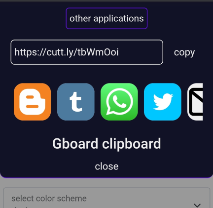

# 
# getting started
```html
<link rel="stylesheet" href="https://cdn.jsdelivr.net/gh/NotableApp/share-ui/cdn/default.css">
<script src="https://cdn.jsdelivr.net/gh/NotableApp/share-ui/cdn/share.js"></script>
```
# how it works ?
A simple snippet will let you create the share ui
```js
var boost = Ted();
boost.share({
     text:"Loren ipsum",
     url:"whatever.xyz",
     title:"your title",
});
/* This will create simple ui */
```
# complex alerts for complex projects
We all know that complex projects sites needs a better performance it contains dark mode like features so don't worry we have workde for it also .
```html
<meta name="ted-globalmode" content="dark">
<!-- this works as global mode set -->
<!-- don't worry their is also js option -->
```
## global settings
You are able to set some settings as global mode.
```js
var boosted = Ted();
boosted.globalSet({
   mode:'dark',
   allowTo:[/* choose which media you wanted */],
});
boosted.share({
   title:'title',
   text:'text',
   url:'url.url',
});
```
# available medias
**Twitter, Whatsapp, Google search , blogger ,Tumblr , reddit , sms ,mail , create note with boosted notable app**

All the above medias are available.Choose the medias from above and use them as Param `alowTo` (array) if you have not defined the allowTo then all medias will selected .
*In code*
``` javascript
const medias = ["twitter","bolgger","search","reddit","sms","mail","tumblr","boosted","whatsapp"]
var method = Ted();
method.globalSet({
       allowTo:medias,
});
```
 
